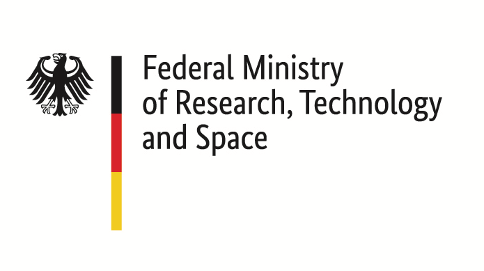
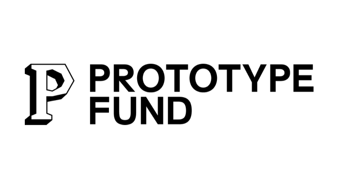

# appointment-booking

End-to-end encrypted appointment booking platform

## Local development

- Create your own local `.env` file. You can base it on [.env.example](./.env.example)
- `npm install`
- `npm run docker:dev:up`
- `npm run dev`

## Funding

This project is funded by:

