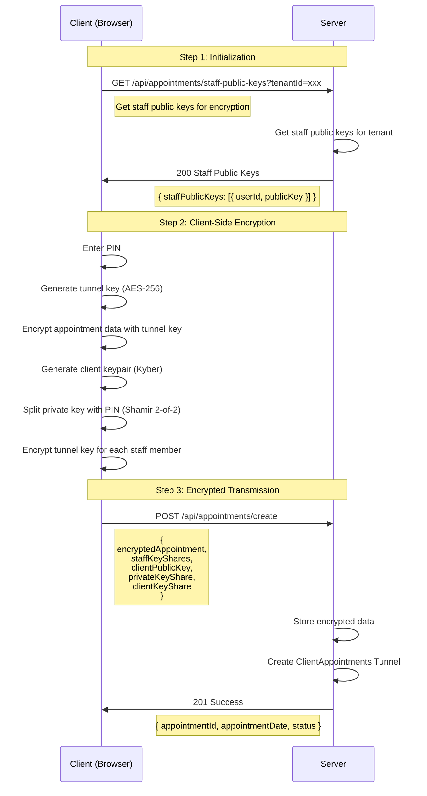
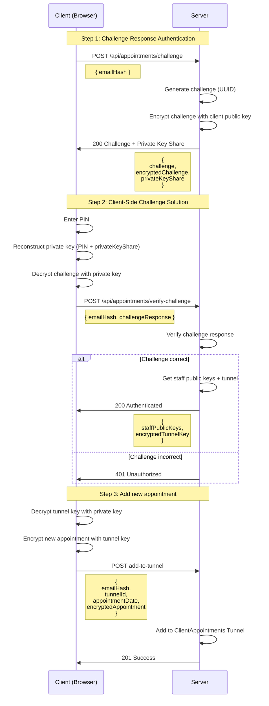
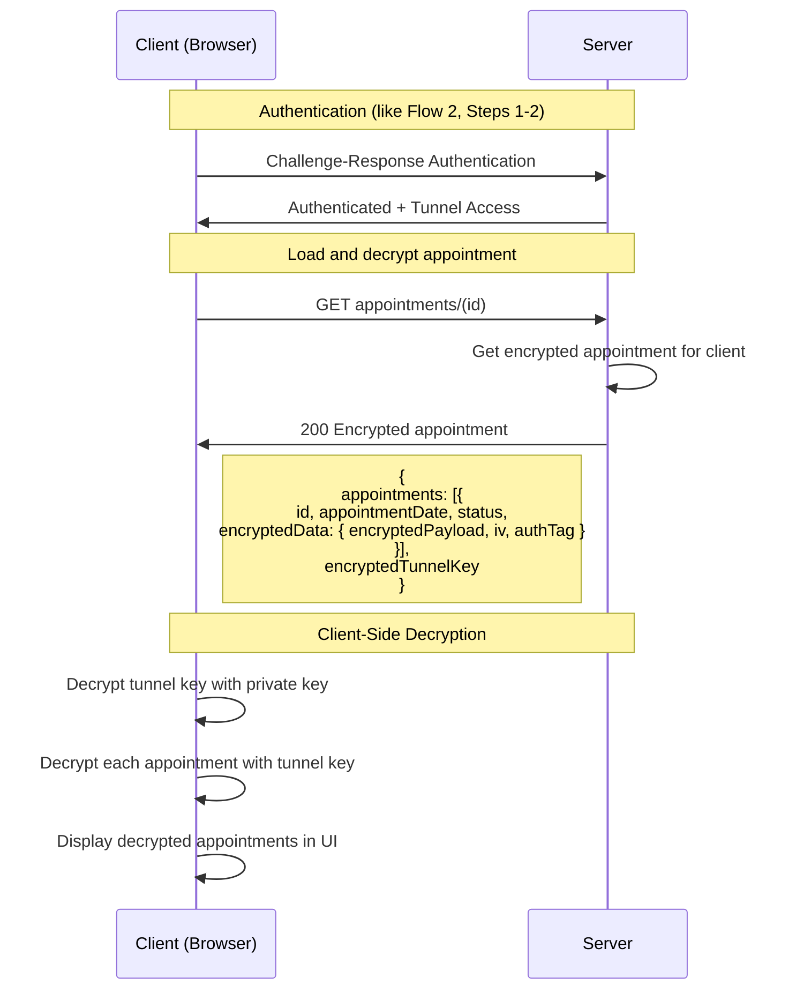

# Client-Side End-to-End Encryption for Appointment Bookings

## Overview

This document describes the revised concept for end-to-end encrypted appointment bookings with client-side encryption. The system implements a zero-knowledge architecture where the server never has access to unencrypted personal data.

## Security Principles

1. **Zero-Knowledge Server**: Server never sees plaintext data
2. **Client-Side Encryption**: All crypto operations in the browser
3. **PIN stays secret**: PIN never leaves the client
4. **Challenge-Response**: Secure authentication without PIN transmission
5. **Post-Quantum Cryptography**: ML-KEM-768 (Kyber) for key exchange
6. **ClientAppointments Tunnel**: Scalable appointment encryption like chat channels

## Architecture Components

### 1. ClientAppointments Tunnel Concept

Each client has an encrypted "tunnel" with all their appointments for a tenant:

```
ClientAppointmentsTunnel:
├── Encrypted Appointments (List)
├── Tunnel Key (AES-256)
├── Client Key Share (PIN-derived)
└── Staff Key Shares (Kyber-encrypted)
```

### 2. Cryptographic Primitives

- **ML-KEM-768 (Kyber)**: Post-Quantum Key Exchange (encrypts the tunnel key)
- **AES-256-GCM**: Symmetric encryption of appointment data (encryption unique per tunnel)
- **Shamir Secret Sharing**: Private Key Split (2-of-2)
- **Argon2**: PIN-based key derivation
- **Challenge-Response**: Secure authentication for clients (based on the PIN)

## Flow Diagrams

### Flow 1: New Client



### Flow 2: Existing Client



### Flow 3: Client loads an apppointment



## Security Considerations

### What the server never sees:

- ✅ Client's PIN
- ✅ Plaintext names, email, phone
- ✅ Complete private key
- ✅ Tunnel key in plaintext

### What the server sees:

- ✅ Email hash (for client identification)
- ✅ Appointment date and time
- ✅ Tunnel ID (public)
- ✅ Encrypted payloads
- ✅ Appointment status

### Attack vectors and countermeasures:

1. **Server compromise**: Server cannot decrypt encrypted data
2. **Man-in-the-Middle**: HTTPS + Key-Pinning can protect transmission
3. **Brute-Force PIN**: Argon2 + Client-Side Rate-Limiting
4. **Timing attacks**: Constant response times for challenge-response
5. **Side-Channel**: All crypto operations in Web Crypto API

## Performance Considerations

### Client-Side:

- Kyber Key Generation: ~10ms
- AES Encryption: <1ms per appointment
- Challenge-Response: <5ms
- **Total time new client**: ~50ms
- **Total time existing client**: ~20ms

### Server-Side:

- No crypto operations
- Only database I/O
- **Highly scalable** due to stateless design
