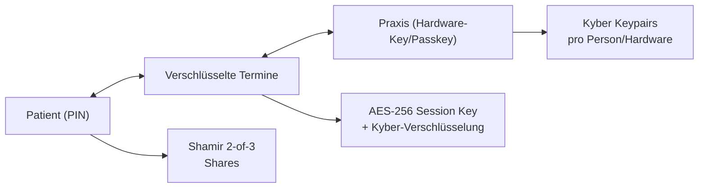

# Terminverschlüsselung _OpenReception_

## Überblick

Dieses Dokument beschreibt ein sicheres, post-quantum-resistentes Verschlüsselungssystem für die Terminbuchung zwischen Patienten und Arztpraxen. 

Das System basiert auf **Crystals-Kyber** für asymmetrische und **AES-256** für symmetrische Verschlüsselung.

### Grundprinzipien
- **Zero-Knowledge**: Die Praxis sieht nur die Zeitstempel der Termine, alle anderen Daten sind verschlüsselt, bis sie durch eine Praxismitarbeiterin mit gültigem Zugriff oder den Patienten entschlüsselt.
- **Post-Quantum-Sicherheit**: Das Setzen auf Kyber bietet Schutz vor zukünftigen Quantencomputern. Der Algorithmus ist zudem vom rechnerischen Aufwand her nicht so anspruchsvoll, dass er ältere Zugriffsgeräte über die Maßen belastet.
- **Benutzerfreundlichkeit**: Patienten erhalten über eine 6-8-stellige PIN Zugriff auf ihre Termine. Durch eine Splittung der privaten Schlüssel erreichen wir ttrotz des einfachen Zugriffs ein hohes Schutzniveau.
- **Flexibilität**: Wir nutzen Hardware-Keys und Passkeys für das Praxis-Personal. Weitere Zugriffe können in den System eingepflegt werden, dass in diesem Fall eine notwendigen Anpassungen an bestehenden Daten/Verschlüsselungen vornimmt.
- **Ausfallsicherheit**: Mehrere Entschlüsselungsoptionen sind gegeben. Auf diese Weise können wir sicherstellen, dass der Zugriff auf das System nicht verloren geht und nach eingehender Prüfung z.B. auch für einen Patienten, der seine PIN vergessen hat, ein neuer Zugriff eingerichtet werden kann.

## Architektur-Überblick

Dem folgenden Diagramm kann der Informationsfluss so wie die greifende Verschlüsselung entnommen werden.

## Verschlüsselung der Daten

Datensätze werden auf dem Server symmetrisch mit einem AES-256-Schlüssel verschlüsselt - der Schlüssel ist dabei für jeden Termin einzigartig. Dieser Schlüssel wiederum wird einmal für Praxis und Patient mit deren Public Keys verschlüsselt, und ist damit nur für die Praxis und den Patienten zugreifbar.

## Patienten-Verschlüsselung

Für die Patienten verwenden wir einen Ansatz, der eine möglichst hohe Benutzerfreundlichkeit ermöglicht, ohne dass wir Daten über den Patienten unverschlüsselt zentral speichern müssen.

### Schlüssel-Management mit Shamir Secret Sharing (2-of-3)

Für Patienten erzeugen wir jeweils ein Schlüsselpaar zur asymmetrischen Verschlüsselung. Den privaten Schlüssel teilen wir dabei in 3 Shares auf, von denen 2 für eine Entschlüsselung genügen. Ein Share wird auf dem Server abgelegt, ein weiterer ergibt sich aus der PIN des Nutzers. Der dritte Share kann zum Beispiel im Browserspeicher gehalten werden, um den Benutzer nach erstmaliger Verifikation einfachereren Zugriff zu gewähren.  

#### Share-Funktionen
- **Share A (PIN-abgeleitet)**: Aus PIN + PatientID reproduzierbar, nicht gespeichert
- **Share B (Server)**: Verschlüsselt auf Server, Rate-Limited access
- **Share C (Browser)**: Lokal gespeichert für schnelleren Zugriff

Eine Rekonstruktion des Private Keys ist damit für folgende Szenarien möglich:

1. Neues Gerät: PIN + Server-Share (A + B)
2. Bekanntes Gerät: PIN + Browser-Share (A + C, schneller)
3. Server offline: PIN + Browser-Share (z.B. um lokal gespeicherte Termine zu entschlüsseln) 

### Patientenidentifikation

Obwohl wir kein Sessionmanagement betreiben und keine direkten Daten über Nutzer auf dem Server ablegen möchten, müssen wir dennoch eine gewisse Rekonstruierbarkeit gewährleisten, damit ohne Aufwand für den Patienten auch ein Zugriff auf mehrere Termine möglich bleibt. Daz nutzen wir:

- **Primär**: PatientID - Hash (Argon2) der E-Mail-Adresse (wiederverwendbar für mehrere Termine)
- **Sekundär**: 6-8-stellige PIN zur Schlüssel-Freischaltung
- **iCal-Integration**: PatientID wird in Kalendereinträgen eingebettet

## Praxis-Verschlüsselung

Für Praxen nutzen wir ein anderes Verfahren. Praxen müssen Zugriff auf eine größere Menge von Terminen haben, und zugleich ist üblicherweise ein größerer Personenkreis für den Zugriff berechtigt. 

### Schlüssel-Architektur
- **Ein Keypair pro Person oder Hardware-Key** (nicht pro Arbeitsplatz)
- **Flexible Authentifizierung**: Hardware-Token (YubiKey) oder Passkeys
- **Granulare Berechtigungen**: Je nach Rolle unterschiedliche Zugriffsrechte

Yubikeys können genutzt werden, um Workstations unabhängig von spezifschen Personen zu authentifizieren, ohne dass die Person selbst den Passkey eingibt. Zudem bieten wir die Möglichkeit, Termine personen- und Gerätebezogen durch Passkeys zu entschlüsseln.

## Termin-Verschlüsselung

### Verschlüsselungsflow
1. **Session Key**: Zufälliger AES-256 Schlüssel pro Termin
2. **Daten-Verschlüsselung**: Termindaten mit Session Key verschlüsselt
3. **Schlüssel-Verschlüsselung**: Session Key für Patient + alle Praxis-Schlüssel verschlüsselt
4. **Speicherung**: Nur verschlüsselte Daten + Zeitstempel (unverschlüsselt)

## Schlüssel-Management

Das Hinzufügen neuer Patientenschlüssel geschieht automatisch und ist relativ unproblematisch, da diese sich immer
auf einen oder mehrere konkrete Termine eines Patienten beziehen. Werden neue Schlüssel für eine Praxis generiert (neue mitarbeitende Person), so müssen alle Termine aktualisiert werden. Mit einem bestehenden Schlüssel werden alle Session Keys der Termine ermittelt und mit dem neuen Schlüssel erneut verschlüsselt, um auch diesem Zugriff auf die Termine zu gewähren.

### Praxis-Schlüssel entfernen

Solange mindestens ein Praxis-Schlüssel erhalten bleibt, gestaltet sich die Entfernung eines Praxisschlüssels leicht. Der Schlüssel und alle zugehörigen Session Keys werden gelöscht, der Schlüssel verliert damit alle Zugriffsrechte.

## Recovery-Verfahren für Patienten

Vergisst ein Patient seine PIN, so muss ein Recovery-Prozess eingeleitet werden (dies erfordert in aller Regel eine persönliche Identifikation des Patienten durch die Praxis, um datenschutzkonform zu bleiben). In diesem Fall werden alle Termine des Patienten ermittelt, durch die Praxis entschlüsselt und mit einem neuen Patienten-Keypair wieder verschlüsselt. Dieses wird zuvor mit der Wunsch-PIN des Patienten versehen (dieser erhält einen Magic Link oder einen QR-Code, bei dem er seine neue PIN vergeben kann). Das alte Schlüsselpaar des Patienten wird danach gelöscht.

## Technische Sicherheitsmaßnahmen

Folgende technische Sicherheitsmaßnahmen erscheinen sinnvoll bzw. lassen sich anhand des Konzepts bewerten.

### PIN-Sicherheit
- **Argon2id** mit hohen Parametern (memory=64MB, iterations=10)
- **Rate-Limiting** auf Server (max 3 Versuche/Stunde)
- **Fester Salt** (PatientID) für Reproduzierbarkeit
- **Share-basierte Sicherheit** schützt vor Brute-Force

### Server-Sicherheit
- **Keine Klardaten** außer Zeitstempel
- **Verschlüsselte Schlüssel-Shares** 
- **Audit-Logs** für alle Zugriffe
- **Rate-Limiting** für alle Authentifizierungsoperationen

### Post-Quantum-Sicherheit
- **Crystals-Kyber** für alle asymmetrischen Operationen
- **AES-256** für symmetrische Verschlüsselung
- **Forward Secrecy** durch Session Keys pro Termin

## Weutere Implementierungs-Hinweise

Die folgenden Ideen sollten bei der Implementierung beachtet werden:

### Performance-Optimierungen
- **Batch-Processing** für Schlüssel-Updates (neuer Praxis-Schlüssel)
- **Browser-Caching** von Share C für wiederkehrende Nutzer
- **Lazy Loading** von Termindaten in der Praxis
- **Background-Jobs** für automatische Schlüssel-Propagation

### Benutzerfreundlichkeit
- **iCal-Integration** mit eingebetteter PatientID
- **Passkey-Support** für technisch versierte Nutzer (als Alternative zur PIN)
- **Hardware-Token oder Passkeys** für Praxis-Personal
- **Automatische Schlüssel-Rotation** im Hintergrund

### Skalierbarkeit
- **Modularer Aufbau** für einfache Erweiterungen
- **Flexible Authentifizierung** (PIN, Passkey, Hardware-Token)
- **Granulare Berechtigungen** je nach Benutzerrolle können für Praxen angedacht werden
- **Horizontale Skalierung** durch Session-Key-Architektur

## Zusammenfassung der Vorteile dieses Konzepts

1. **Zero-Knowledge für Praxis**: Patientendaten bleiben auch bei Server-Kompromittierung geschützt
2. **Geräteunabhängigkeit**: Patienten können von überall auf ihre Termine zugreifen
3. **Benutzerfreundliche PIN**: 6-8-stellige PIN ist für alle Nutzer verständlich
4. **Post-Quantum-Sicherheit**: Schutz vor zukünftigen Quantencomputern
5. **Forward Secrecy**: Jeder Termin hat eigenen Session Key
6. **Ausfallsicherheit**: 2-of-3 Secret Sharing erlaubt Verlust eines Shares
7. **Flexible Praxis-Integration**: Hardware-Keys und Passkeys je nach Präferenz
8. **Skalierbare Schlüsselverwaltung**: Einfaches Hinzufügen/Entfernen von Praxis-Personal

## Technische Spezifikationen verwendete Kryptographie-Algorithmen

- **Asymmetrische Verschlüsselung**: Crystals-Kyber (Post-Quantum)
- **Symmetrische Verschlüsselung**: AES-256-GCM
- **Key Derivation**: Argon2id (memory=64MB, iterations=10)
- **Secret Sharing**: Shamir's Secret Sharing (2-of-3)
- **Authentifizierung**: WebAuthn (Passkeys), FIDO2 (Hardware-Token)
- **Hashing**: SHA-256 für Identifier-Ableitung
- **Session Keys**: 256-bit zufällige Schlüssel pro Termin