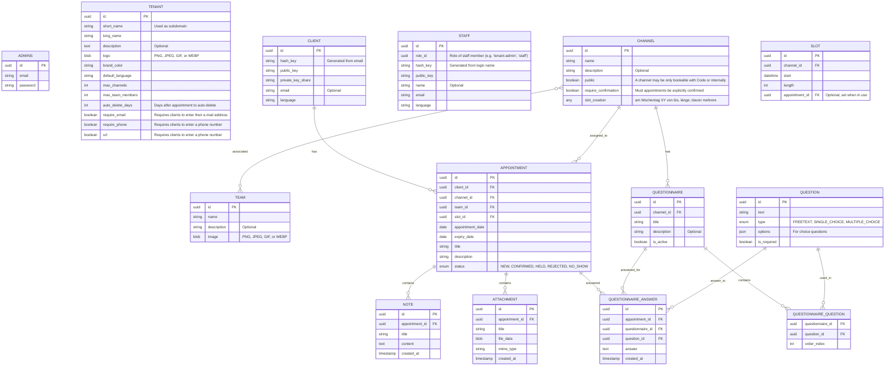

# Entity-Relationship Diagram

## Appointment Booking Platform Data Structure

Please note that this is currently the **unencrypted data model**. Appointments, Notes, Attachments and Answers of course have to be encrypted before being stored in the database.

## Database Architecture Notes

- **Multi-tenancy**: Each tenant operates with a separate database instance
- **No explicit tenant references**: Since each tenant has its own database, foreign key relationships don't need to reference the tenant
- **Encryption**: The system uses end-to-end encryption with public/private key pairs for clients and staff
- **Hash-based identification**: Both clients and staff are identified by hash keys derived from their credentials
- **Flexible appointments**: Appointments support multiple notes and attachments for comprehensive record keeping

## Entity Descriptions

### TENANT

Central configuration entity (exists in a separate management database, not in tenant-specific databases)

### CLIENT

End-to-end encrypted client records with optional email for notifications

### STAFF

Practice staff members with minimal required information for privacy

### CHANNEL

Represents bookable resources such as rooms, machines, or personnel that appointments can be scheduled for

### APPOINTMENT

Core booking entity with flexible status management and expiry handling, now linked to specific channels

### NOTE

Text-based annotations attached to appointments

### ATTACHMENT

File attachments (documents, images, etc.) associated with appointments

### QUESTIONNAIRE

Collection of questions associated with a specific channel, can be activated/deactivated

### QUESTION

Individual questions that can be reused across multiple questionnaires, supporting different answer types

### QUESTIONNAIRE_QUESTION

Junction table linking questionnaires to questions with ordering information

### QUESTIONNAIRE_ANSWER

Stores answers provided by clients for specific appointments and questionnaires
