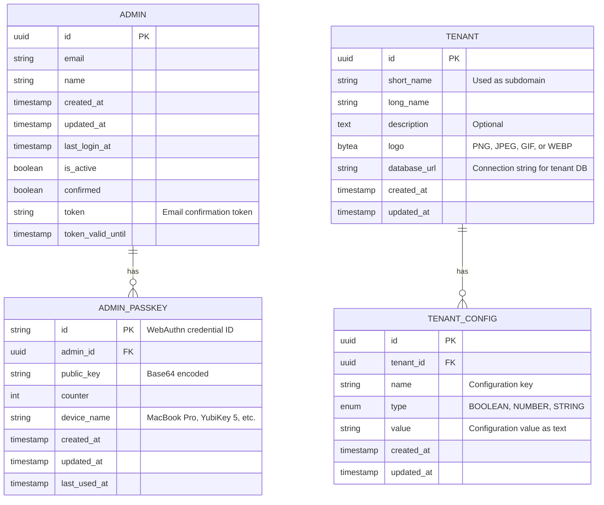

# Entity-Relationship Diagram

## Appointment Booking Platform Data Structure

Please note that this is currently the **unencrypted data model**. Appointments, Notes, Attachments and Answers of course have to be encrypted before being stored in the database.

### Central database

### Tenant-specific database

```mermaid
erDiagram

    CLIENT {
        uuid id PK
        string hash_key "Generated from email"
        string public_key
        string private_key_share
        string email "Optional"
        string language
    }

    STAFF {
        uuid id PK
        uuid role_id "Role of staff member (e.g. 'tenant-admin', 'staff')"
        string hash_key "Generated from login name"
        string public_key
        string name "Optional"
        string email
        string language
    }

    TEAM {
        uuid id PK
        string name
        string description "Optional"
        blob image "PNG, JPEG, GIF, or WEBP"
    }

    CHANNEL {
        uuid id PK
        string name
        string color
        string description "Optional"
        boolean public "A channel may be only bookable with Code or internally"
        boolean require_confirmation "Must appointments be explicitly confirmed"
        any slot_creation "am Wochentag XY von bis, länge; davon mehrere"
    }

    SLOT {
        uuid id PK
        uuid channel_id FK
        datetime start
        int length
        uuid appointment_id FK "Optional, set when in use"
    }

    APPOINTMENT {
        uuid id PK
        uuid client_id FK
        uuid channel_id FK
        uuid team_id FK
        uuid slot_id FK
        date appointment_date
        date expiry_date
        string title
        string description
        enum status "NEW, CONFIRMED, HELD, REJECTED, NO_SHOW"
    }

    NOTE {
        uuid id PK
        uuid appointment_id FK
        string title
        text content
        timestamp created_at
    }

    ATTACHMENT {
        uuid id PK
        uuid appointment_id FK
        string title
        blob file_data
        string mime_type
        timestamp created_at
    }

    QUESTIONNAIRE {
        uuid id PK
        uuid channel_id FK
        string title
        string description "Optional"
        boolean is_active
    }

    QUESTION {
        uuid id PK
        string text
        enum type "FREETEXT, SINGLE_CHOICE, MULTIPLE_CHOICE"
        json options "For choice questions"
        boolean is_required
    }

    QUESTIONNAIRE_QUESTION {
        uuid questionnaire_id FK
        uuid question_id FK
        int order_index
    }

    QUESTIONNAIRE_ANSWER {
        uuid id PK
        uuid appointment_id FK
        uuid questionnaire_id FK
        uuid question_id FK
        text answer
        timestamp created_at
    }

    CLIENT ||--o{ APPOINTMENT : "has"
    CHANNEL ||--o{ APPOINTMENT : "assigned_to"
    CHANNEL ||--o{ QUESTIONNAIRE : "has"
    CHANNEL }o--o{ TEAM : "associated"
    APPOINTMENT ||--o{ NOTE : "contains"
    APPOINTMENT ||--o{ ATTACHMENT : "contains"
    QUESTIONNAIRE ||--o{ QUESTIONNAIRE_QUESTION : "contains"
    QUESTION ||--o{ QUESTIONNAIRE_QUESTION : "used_in"
    APPOINTMENT ||--o{ QUESTIONNAIRE_ANSWER : "answered"
    QUESTIONNAIRE ||--o{ QUESTIONNAIRE_ANSWER : "answered_for"
    QUESTION ||--o{ QUESTIONNAIRE_ANSWER : "answer_to"
```

## Database Architecture Notes

- **Multi-tenancy**: Each tenant operates with a separate database instance
- **Central vs. Tenant Databases**:
  - Central database contains: `ADMIN`, `ADMIN_PASSKEY`, `TENANT`, `TENANT_CONFIG`
  - Tenant-specific databases contain: `CLIENT`, `STAFF`, `CHANNEL`, `APPOINTMENT`, etc.
- **No explicit tenant references**: Since each tenant has its own database, foreign key relationships don't need to reference the tenant
- **Encryption**: The system uses end-to-end encryption with public/private key pairs for clients and staff
- **Hash-based identification**: Both clients and staff are identified by hash keys derived from their credentials
- **WebAuthn Authentication**: Admins use WebAuthn passkeys for secure authentication
- **Flexible appointments**: Appointments support multiple notes and attachments for comprehensive record keeping

## Entity Descriptions

### ADMIN (Central Database)

System administrators who manage the platform and tenants. Uses WebAuthn for secure authentication.

### ADMIN_PASSKEY (Central Database)

WebAuthn credentials for admin authentication. Each admin can have multiple passkeys (different devices).

### TENANT (Central Database)

Central configuration entity for each tenant organization. Contains database connection information for tenant isolation.

### TENANT_CONFIG (Central Database)

Flexible configuration system for tenant-specific settings. Each tenant can have multiple typed configuration entries.

### CLIENT (Tenant Database)

End-to-end encrypted client records with optional email for notifications

### STAFF (Tenant Database)

Practice staff members with minimal required information for privacy

### CHANNEL (Tenant Database)

Represents bookable resources such as rooms, machines, or personnel that appointments can be scheduled for

### APPOINTMENT (Tenant Database)

Core booking entity with flexible status management and expiry handling, now linked to specific channels

### NOTE (Tenant Database)

Text-based annotations attached to appointments

### ATTACHMENT (Tenant Database)

File attachments (documents, images, etc.) associated with appointments

### QUESTIONNAIRE (Tenant Database)

Collection of questions associated with a specific channel, can be activated/deactivated

### QUESTION (Tenant Database)

Individual questions that can be reused across multiple questionnaires, supporting different answer types

### QUESTIONNAIRE_QUESTION (Tenant Database)

Junction table linking questionnaires to questions with ordering information

### QUESTIONNAIRE_ANSWER (Tenant Database)

Stores answers provided by clients for specific appointments and questionnaires
